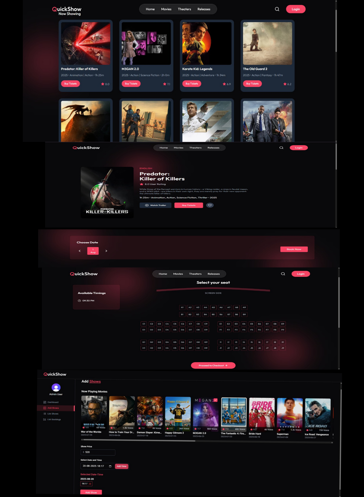

<div align="center">

# QUICKSHOW 🎬🍿🎥


<br />

## 🎦 LIVE - DEMO 🌐
  
**UI** 👉 [LINK](https://quickshow-sigma-roan.vercel.app/)

##⚠️ Warning: Movies Section Not Displaying

#If the Movies section is not opening or is showing the message:
#“Movies not available”,
#this likely means that the API key has expired.
#The API key is time-limited and may need to be refreshed periodically.
#As a result, the MongoDB server cannot connect to the main server, preventing movies from being fetched or displayed.

#🔧 To resolve this issue, ensure the API key is valid and properly configured in your environment variables.

#📸 Reference Screenshots

#Below are screenshots showing how the frontend and backend are expected to look and function when everything is working correctly:


<br /><hr /><br />

**Admin Dashboard** 👉 [LINK](https://quickshow-sigma-roan.vercel.app/admin)



</div>

 **Environment Configuration**
   
   Create `.env` files in both `server` and `client` directories:
   
   **Server (.env)**
   ```env
   # 🌐 Database
   MONGODB_URI=mongodb://localhost:27017/quickshow
    
   # 🔐 Clerk Authentication
   CLERK_PUBLISHABLE_KEY=your-clerk-publishable-key
   CLERK_SECRET_KEY=your-clerk-secret-key
    
   # ⚙️ Inngest Event Scheduling
   INNGEST_EVENT_KEY=your-inngest-event-key
   INNGEST_SIGNING_KEY=your-inngest-signing-key
    
   # 🎬 TMDB API (for movie data)
   TMDB_API_KEY=your-tmdb-api-key
    
   # 💳 Stripe Payment Integration
   STRIPE_PUBLISHABLE_KEY=your-stripe-publishable-key
   STRIPE_SECRET_KEY=your-stripe-secret-key
   STRIPE_WEBHOOK_SECRET=your-stripe-webhook-secret
    
   # 📧 Email Notifications (Nodemailer or similar SMTP setup)
   SENDER_EMAIL=your-sender@example.com
   SMTP_USER=your-smtp-username
   SMTP_PASS=your-smtp-password

   ```
   
   **Client (.env)**
   ```env
   # 💱 Currency Symbol
   VITE_CURRENCY=$

   # 🔐 Clerk Authentication (Public Key for Frontend)
   VITE_CLERK_PUBLISHABLE_KEY=your-clerk-publishable-key

   # 🌐 Base API URL (Proxy to Backend)
   VITE_BASE_URL=http://localhost:3000

   # 🎞️ TMDB Image Base URL
   VITE_TMDB_IMAGE_BASE_URL=https://image.tmdb.org/t/p/original

   ```

### Usage

1. **Start the development servers**
   
   **Terminal 1 - Server**
   ```console
   cd server
   npm run dev
   ```
   
   **Terminal 2 - Client**
   ```console
   cd client
   npm run dev
   ```

2. **Access the application**
   - Frontend: `http://localhost:5173`
   - Backend API: `http://localhost:5000`

3. **Admin Access**
   - Create an admin account through the API or manually in the database
   - Access admin panel at `/admin`


